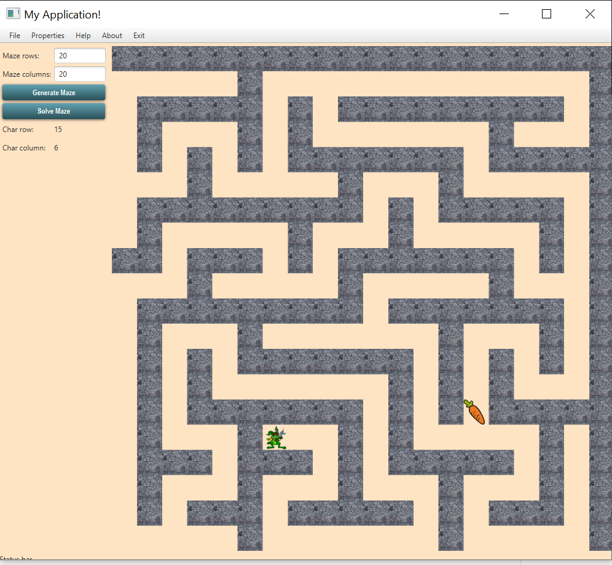
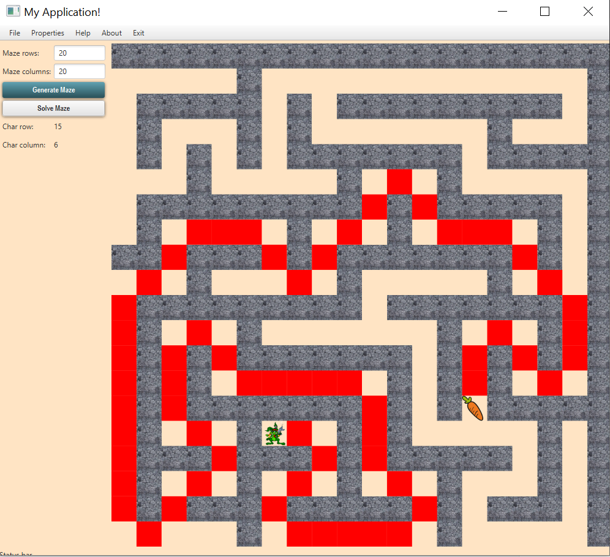
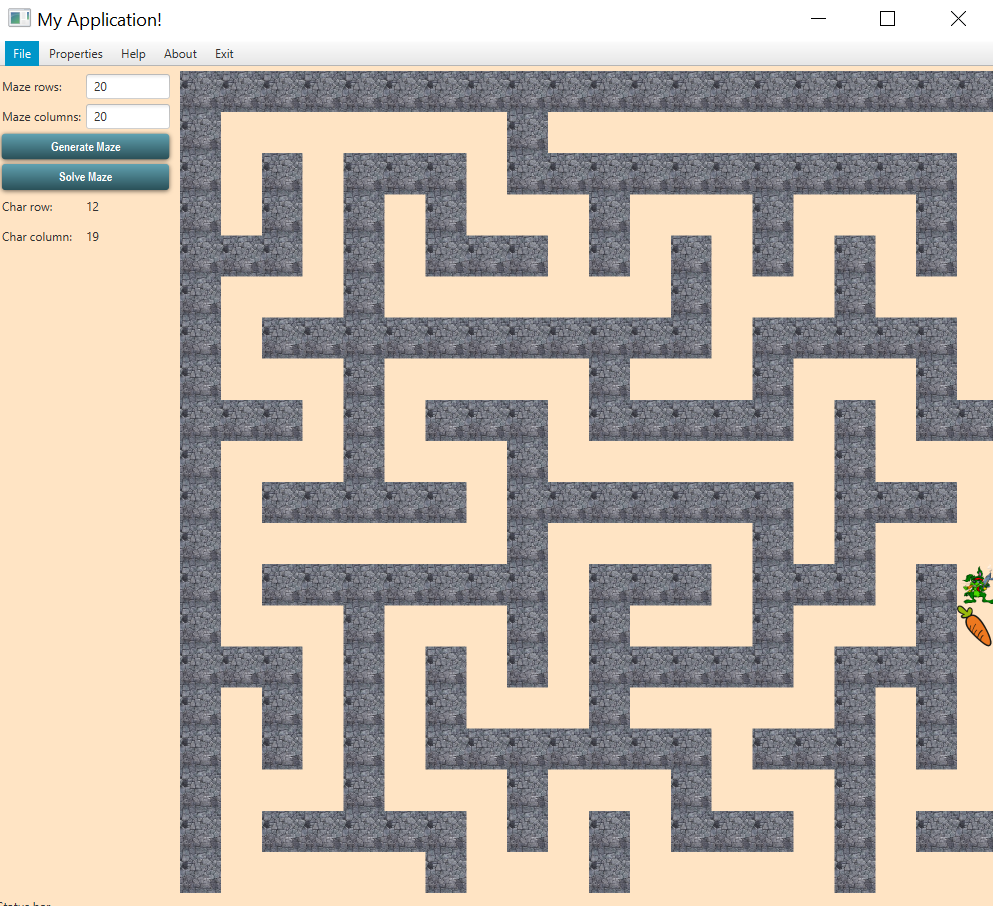

# MazeProjectd
this is a maze game, when the game starts it create a new maze every time.
and with the numpad you can move the character and go to the goal.
there is an option to see the way to the goal by pressing "solve maze"
and with DFS/BFS/BestFS it shows the way to the goal.

